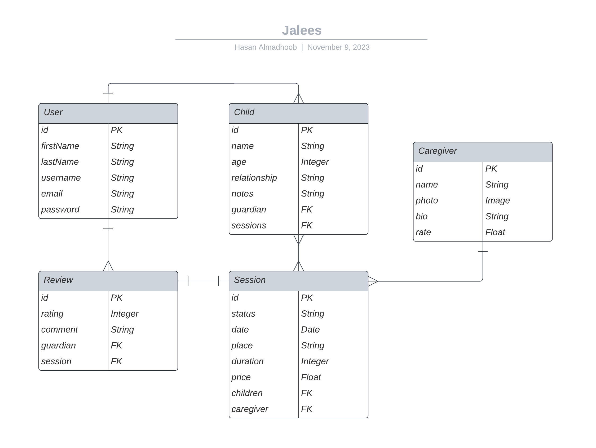

<h1 align="center">
   
  
   
  Jalees
   
</h1>

<h4 align="center">Platform for finding trustworthy caregivers for children.</h4>

  <a href="#key-features">Key Features</a> •
  <a href="#technologies">Technologies</a> •
  <a href="#entity-relationship-diagram">ERD</a> •
  <!-- <a href="#how-to-use">How To Use</a> • -->
  <a href="#credits">Credits</a> •
  <a href="#contact">Contact</a>

<!--  -->

## Key Features

- Register an account as Parent/Guardian
  - Add children/dependents
- Browse available Caregivers
  - View their profile and qualifications
  - Book a babysitting session
- See babysitter reviews and add a review on session

## Technologies

This project is built using MERN stack.

  
  

## Entity Relationship Diagram

## Credits

- [Lucidchart](https://lucid.app/)
- [Electron](http://electron.atom.io/)
- [Skill Icons](https://skillicons.dev/)

## Contact

Feel free to reach me on: [Email](mailto:hasan@madhoob.com) • [LinkedIn](https://www.linkedin.com/in/madhoob/)
